<p align="center">
  
</p>

<h3 align="center">One platform for remote care — patients, doctors, pharmacy delivery and IoT vitals,<br/>with a non-diagnostic AI layer.</h3>

<!-- CI badges: update the owner/repo segment if this repository is renamed or forked. -->
<p align="center">
  <a href="https://github.com/ashrafulislamse/smartcura/actions/workflows/backend-foundation-ci.yml"></a>
  <a href="https://github.com/ashrafulislamse/smartcura/actions/workflows/web-portal-ci.yml"></a>
  <a href="https://github.com/ashrafulislamse/smartcura/actions/workflows/patient-app-ci.yml"></a>
</p>

<p align="center">
  
  
  
  
  
  
</p>

<!-- Numbers re-measured 2026-09-02 via `node tools/status.mjs` -->
<p align="center">
  <strong>251</strong> REST operations ·
  <strong>421</strong> OpenAPI schemas ·
  <strong>9</strong> AsyncAPI channels ·
  <strong>64</strong> migrations ·
  <strong>73</strong> tables ·
  <strong>368</strong> automated checks ·
  <strong>≈260k</strong> authored lines
</p>

<p align="center">
  <a href="https://portal.smartcura.app">portal.smartcura.app</a> ·
  <a href="https://api.smartcura.app/api/v1/health">API health</a> ·
  <a href="https://livekit.smartcura.app">livekit.smartcura.app</a> ·
  <code>wss://mqtt.smartcura.app:9001/mqtt</code>
</p>

> ⚠️ **Prototype status — synthetic data only.** SmartCura is a Final Year Project.
> The live demo runs on synthetic test data, the AI layer is non-diagnostic by design,
> and nothing here is certified or clinically validated. Read the
> [medical disclaimer](#medical-disclaimer) before anything else.

---

## 📸 The four surfaces

| Patient app | Doctor app | Driver app |
|---|---|---|
| 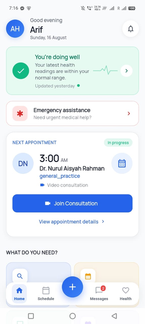 | 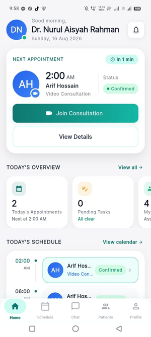 | 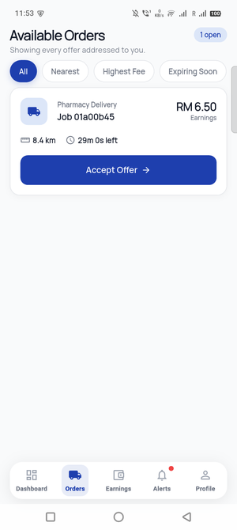 |
| 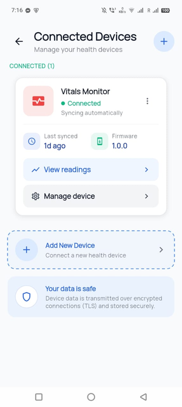 | 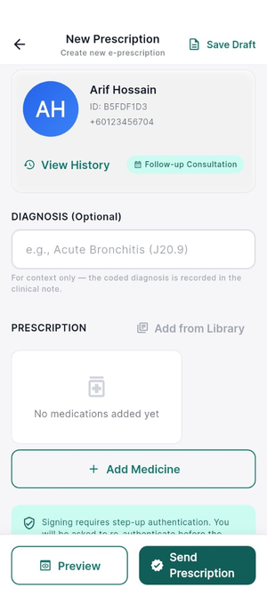 | 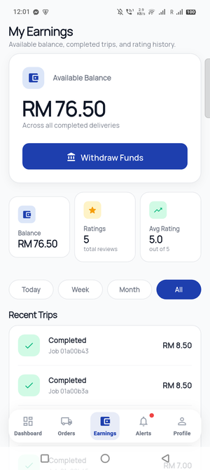 |
| 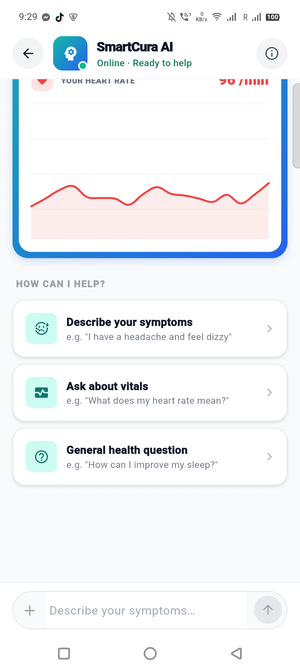 | 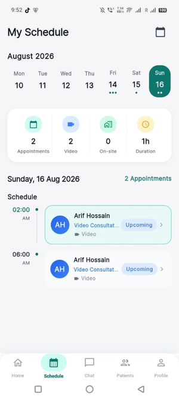 | 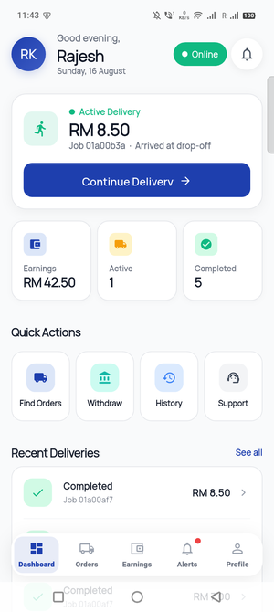 |

**Admin portal**

| Dashboard | Appointments | Devices | Emergency |
|---|---|---|---|
| 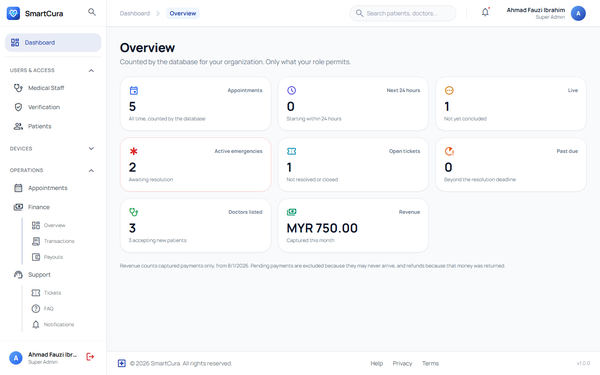 | 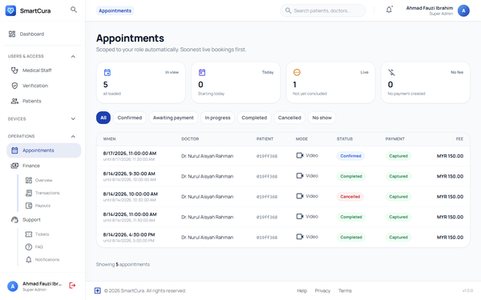 | 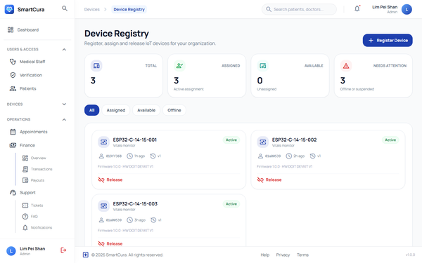 | 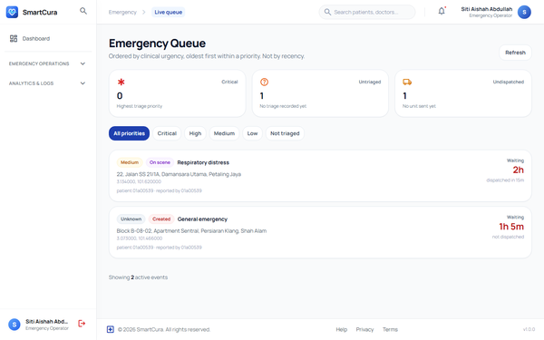 |

All 16 screens live in [`apps/web-portal/public/screenshots/`](apps/web-portal/public/screenshots/).

## 🩺 The problem

Remote care today is fragmented. A chronically ill patient juggles one app for
video calls, a wearable whose vitals go nowhere useful, a pharmacy phone call
and a paper prescription — while the doctor sees none of it in one place, and
the delivery side is a black box.

SmartCura connects that loop in one platform: an ESP32 monitor and Health
Connect feed vitals into the care record, doctors consult and prescribe on top
of that data, pharmacy orders dispatch to drivers with live tracking, and an
emergency SOS path ties patients to staff — with a non-diagnostic AI layer
summarizing trends for humans to review.

## ✨ Feature tour

| Role | Highlights |
|---|---|
| **Patient** | Appointments & LiveKit video consultations · IoT vitals from the ESP32 monitor · Health Connect sync (steps, sleep, glucose…) · AI health summaries & trend analysis (non-diagnostic) · Prescriptions with PDF download · Pharmacy orders & delivery tracking · Emergency SOS with contacts · Messaging with doctors |
| **Doctor** | Dashboard with next appointment & needs-attention queue · Schedule with accept/decline · Assigned patients directory · E-prescriptions: draft → sign, PDF export · LiveKit video calls · Clinical messaging inbox · AI artifacts viewer + assistant (non-diagnostic) |
| **Driver** | Dispatch offers → pickup → dropoff → trip-complete with optimistic concurrency · Live map with streamed GPS, stop coordinates & waypoint reporting · Proof of delivery · Earnings ledger & ratings |
| **Admin (portal)** | 68 wired pages: users & credential verification, appointments, finance & payouts, pharmacy orders & stock, emergency fleet, support tickets, broadcasts, RBAC roles editor, audit logs, analytics |

## 🏗️ Architecture

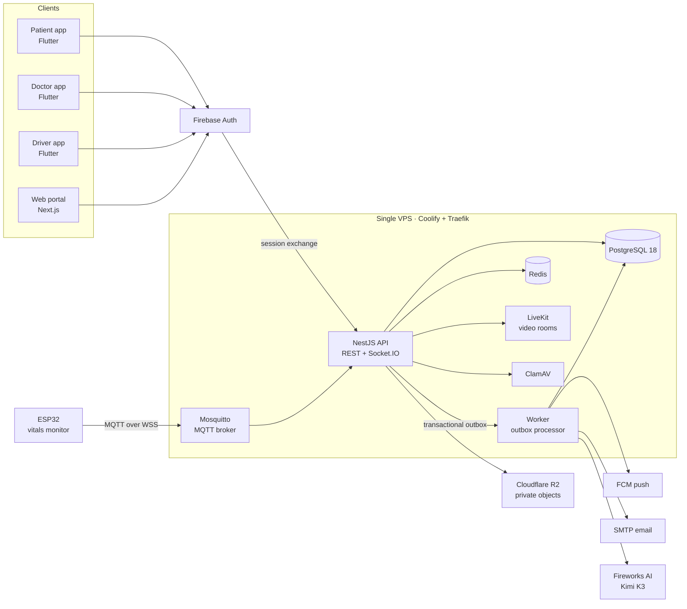

- **Modular monolith + worker.** One NestJS process serves REST and Socket.IO; a separate worker claims PostgreSQL transactional-outbox rows with leases, retries and dead-letter replay — no dual-write, ever.
- **Contract-first.** OpenAPI 3.1 (251 operations, 421 schemas) and AsyncAPI (9 channels) are the source of truth; TypeScript and Dart clients are generated from them, and a CI test fails if a mounted route is missing from the contract.
- **One IoT chain.** ESP32 → MQTT-over-WebSocket → API ingestion → PostgreSQL, with UCUM units, range checks, dedupe and per-device broker credentials.
- **One VPS.** Everything above runs on a single host behind Traefik — an honest prototype reliability boundary, documented as such.

Full detail: [docs/ARCHITECTURE.md](docs/ARCHITECTURE.md)

## 📁 Repository layout

```text
smartcura/
├── apps/
│   ├── api/            # NestJS API + worker + contracts, database, identity,
│   │                   # observability, policy and storage packages
│   ├── web-portal/     # Next.js 15 admin portal + public site
│   ├── patient-app/    # Flutter patient app
│   ├── doctor-app/     # Flutter doctor app
│   └── driver-app/     # Flutter driver app
├── design/brand/       # Logo and icon kit (SVG)
├── docs/               # ARCHITECTURE.md, ROADMAP.md
├── iot-firmware/       # ESP32 firmware, wiring, test sketches, flash scripts
├── tools/              # Measurement, seed and deploy helpers
├── ENVIRONMENT.md      # Every env var: where to get it and why it exists
└── LICENSE             # MIT
```

## 🚀 Getting started

| Surface | Prerequisites |
|---|---|
| Backend | Node.js ≥ 22.19, npm ≥ 10.9, Docker (pinned PostgreSQL 18 container) |
| Portal | Node.js ≥ 22.19 |
| Mobile | Flutter 3.44 stable, Java 17 (Android) |
| Firmware | Arduino IDE (or `arduino-cli`) with the ESP32 toolchain |

**Backend**

```bash
cd apps/api
cp .env.example .env            # placeholders only — no real secrets inside
docker compose up -d postgres   # PostgreSQL 18 — the schema needs server-side uuidv7()
npm ci
npm run db:migrate
npm run check                   # 368 checks — runs without a database
npm run dev:api                 # terminal 1
npm run dev:worker              # terminal 2
```

**Web portal**

```bash
cd apps/web-portal
cp .env.example .env.local
npm install
npm run dev                     # proxies /api/v1/* to the API origin in .env.local
```

**Mobile**

```bash
cd apps/patient-app             # or doctor-app / driver-app
flutter pub get
flutter run
```

Sign-in needs a Firebase project: drop your `google-services.json` into
`android/app/` (gitignored by policy). The driver app's README documents the
full setup, including the Google Maps key.

**Firmware** — see [`iot-firmware/README.md`](iot-firmware/README.md) for the
shopping list and [`iot-firmware/smartcura_vitals_monitor/README.md`](iot-firmware/smartcura_vitals_monitor/README.md)
for wiring, libraries, flashing and the MQTT-over-WebSocket details.

## 📡 The IoT chain

A DOIT ESP32 DevKit V1 with a MAX30102 (heart rate + SpO₂), a DS18B20
body-temperature probe and an SSD1306 OLED reads vitals and publishes them to
the platform:

- **Provisioning** — the patient app discovers the device over BLE, verifies an
  8-digit provisioning PIN and sends Wi-Fi credentials; nothing is hardcoded.
- **Transport** — MQTT over WebSocket (`wss://…:9001/mqtt`), negotiating the
  `mqtt` subprotocol; every device has its own broker credentials.
- **Ingestion** — readings land in PostgreSQL with UCUM units (`/min`,
  `mm[Hg]`, `mg/dL`…), range CHECK constraints, per-sample dedupe and a
  10-minute replay window.
- **Provenance** — each reading joins back to its device, so the AI and the
  apps can tell an ESP32 reading from a Health Connect sync.

## 🤖 The AI layer — non-diagnostic by design

Patients and doctors can request structured AI artifacts: `daily_summary`,
`trend_analysis`, `health_summary` and `symptom_summary`. Before generation the
backend assembles the patient's health context — recent vitals with source
provenance, conditions, medications, risk scores (cardiovascular, fall,
medication, respiratory), anomaly detections, longitudinal trend analysis and
keyword-retrieved knowledge — and sends it to **Fireworks AI (Kimi K3)** via an
OpenAI-compatible adapter. The model must return a structured artifact flagged
`non_diagnostic: true`.

Hard rules: no diagnosis, no medication changes, no clinical write path. Every
artifact names its sources, carries a clinician-review note and renders with a
visible disclaimer in the apps.

## 🔐 Security model

- **RBAC with org/site scoping** — a [permission matrix](apps/api/docs/policy-matrix.md) drives every route; memberships narrow authority to a site.
- **CSRF on every state-changing route** — enforced by a test that allows exactly one exemption (`POST /sessions`, which mints the token).
- **Step-up authentication** for break-glass patient disclosure; **append-only audit logs**.
- **Hardened sessions** — `__Host-` prefixed `SameSite=Strict` cookies, hash-only opaque tokens, derived CSRF tokens.
- **Rate limiting** (Redis), **PHI-redaction tests**, **ClamAV** upload scanning, **private Cloudflare R2** storage, **per-device MQTT credentials**.

## 🧪 Testing

```bash
npm run check    # from the repo root: contract check + type-check + 368 tests
```

The suite runs without a database and includes a route-contract test (every
mounted route must be documented in OpenAPI), CSRF coverage, PHI redaction,
rate limiting, a step-up matrix and a production-dependency graph, plus domain
suites for appointments, consultations, IoT, AI, pharmacy, dispatch, finance
and emergency.

**Load testing.** Three baseline scenarios were executed with k6 v2.2.0
against the live deployment — results are tracked in
[`apps/api/test/load/results/`](apps/api/test/load/results/): 100% request
success at a sustained 60 iterations/min across the API, portal and LiveKit
(p95 < 21 ms), and rate limiting verified at 300 iterations/min (excess
requests rejected with 429). These are smoke-scale baselines, not capacity
claims — the four contention/race scenarios remain unexecuted (see the
[NFR report](apps/api/docs/nfr-measured-vs-target-report.md)).

| Area | Honest status |
|---|---|
| Backend API + worker | ✅ Deployed and verified live |
| Web portal (68 pages) | ✅ All wired to generated API clients |
| Flutter apps | 🟡 Source-complete, debug APKs build — on-device verification ongoing |
| ESP32 firmware | ✅ Publishing live vitals (prototype sensor accuracy is limited) |
| AI layer | ✅ Live, non-diagnostic, human-reviewed |
| Payments | ⚠️ Deterministic stub — out of FYP scope |
| Load / NFR tests | 🟡 3 baseline k6 scenarios executed live (100% success, p95 < 21 ms) · 4 contention scripts unexecuted — [results](apps/api/test/load/results/LOAD_TEST_RESULTS.md) |

The patient-app CI workflow marks its steps `continue-on-error`, so treat its
badge as best-effort rather than proof.

## 📚 Deep documentation

| Document | What it covers |
|---|---|
| [docs/ARCHITECTURE.md](docs/ARCHITECTURE.md) | Surfaces, runtime topology, data and security architecture |
| [docs/ROADMAP.md](docs/ROADMAP.md) | Where the project goes next |
| [ENVIRONMENT.md](ENVIRONMENT.md) | Every environment variable, where to get it, why it exists |
| [apps/api/DEPLOYMENT.md](apps/api/DEPLOYMENT.md) | Deployment paths, MQTT setup, rollback |
| [apps/api/docs/operational-runbook.md](apps/api/docs/operational-runbook.md) | Day-2 operations |
| [apps/api/docs/threat-model-and-data-inventory.md](apps/api/docs/threat-model-and-data-inventory.md) | Threat model and data inventory |
| [apps/api/docs/policy-matrix.md](apps/api/docs/policy-matrix.md) | Role × permission matrix |
| [apps/api/docs/backup-restore-rehearsal.md](apps/api/docs/backup-restore-rehearsal.md) | Backup and restore rehearsal |
| [apps/api/docs/enum-state-catalogue.md](apps/api/docs/enum-state-catalogue.md) | Every enum and state machine |
| [apps/api/docs/dependency-audit.md](apps/api/docs/dependency-audit.md) | Dependency decisions |
| [apps/api/docs/vitals-capacity-plan.md](apps/api/docs/vitals-capacity-plan.md) | IoT readings capacity planning |
| [apps/api/docs/screen-capability-matrix.md](apps/api/docs/screen-capability-matrix.md) | Portal screen ↔ capability map |
| [apps/api/docs/nfr-measured-vs-target-report.md](apps/api/docs/nfr-measured-vs-target-report.md) | NFR targets vs measured reality |

## Medical disclaimer

SmartCura is an **educational prototype** built for a Final Year Project. It
runs on **synthetic data only** and uses non-certified prototype sensors.

It is **not** a medical device and has not been certified, validated or
approved under ISO 13485, IEC 62304, the EU MDR, FDA QSR or any equivalent
regime. It must **not** be used for diagnosis, treatment, real patient care,
real emergency response or commercial pharmacy delivery. The AI layer is
non-diagnostic by design and its output requires clinician review.

## 🙏 Acknowledgements

Built as a Final Year Project at **City University Malaysia**, supervised by
**Dr. Mohammad Kazem Chamran**.

## 👤 Author

**Islam Md Ashraful**
[contact@ashrafulislam.dev](mailto:contact@ashrafulislam.dev) · [ashrafulislam.dev](https://ashrafulislam.dev) · [@ashrafulislamse](https://github.com/ashrafulislamse)

## 📄 License

Released under the [MIT License](LICENSE).

Additional notices: this project was developed as a Final Year Project at
**City University Malaysia**. It is an educational prototype built for
academic evaluation — it demonstrates software engineering principles,
system architecture and full-stack development capabilities, and it is
**not** a medical device. Read the [medical disclaimer](#medical-disclaimer)
before reusing any part of this project.
